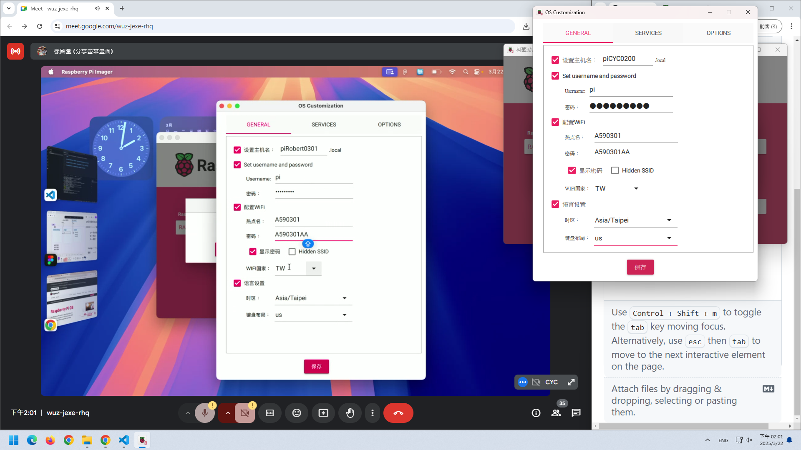
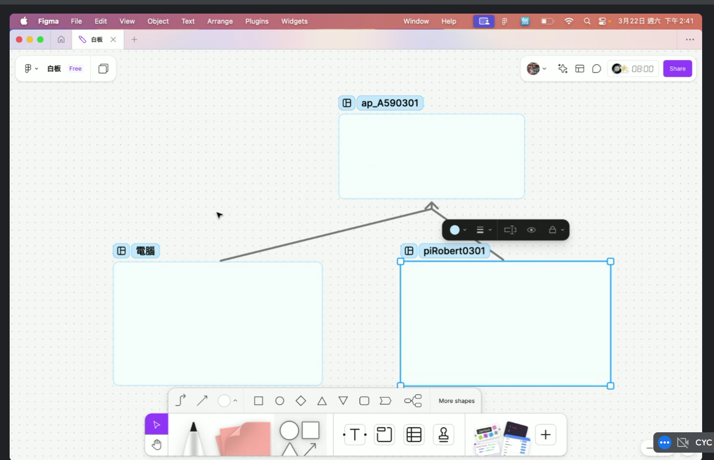

# hardward overview
- instructor provides Raspberry Pi 5, power cord, and SD card
- prevent from short circuit, place the raspberry on paper


# PC software setup

- download from PC browser
- Device: choose "Pi 5"
- OS: choose latest 64-bit
- when clicking "Next", customize OS for this course
- device name pi+name
- user name "pi"
- password "raspberry"
- enable wifi to classroom AP
- enable SSH in SERVICE tab

# Raspberry Pi initialization
- after mini SD (OS) is ready, insert to device
- connect to power

## on PC, simulate terminal *Warp*, an AI-based software

- download from PC warp.dev [link](https://www.warp.dev/)
- signin is possible with Google account
- both PC (where Wrap is installed) and Raspberry Pi must connect to a same AP (wifi network)
- connect from PC to Raspberry Pi via SSH
- query for detail steps by asking question to Wrap AI
> how to connect my Raspberry Pi device via SSH?
- once connected, Wrap will display pi@piCYC0200
- connectino can also be made via other command-line environment, such as VSCode terminal
```
ssh pi@piCYC0200.local
```
- troubleshooting: reboot the Raspberry Pi, or format it and install again

## setup Raspberry Pi from terminal
- from terminal, call menu by "SuperUser Do" command
```
sudo raspi-config
```
- enable VNC (3)
- install languages en_GB, en_US, and UTF-8 at (5)
- configure time zone at (5)
- select WIFI country to TW at (5)
- run update (8)
- click `Finish`
- reboot the Raspberry Pi device by `sudo reboot` or simply unplug the device, and plug again after several seconds to reflect update

## alternatively configure by VNC viewer
- download for Windows [link](https://www.realvnc.com/en/connect/download/viewer/)
- connect to Raspberry Pi by entering `piCYC0200.local` on VNC
- user shall view Raspberry Pi desktop from VNC viewer

# home assignment
- clear from PC all SSH known host (usually save under`C:\Users\<YourUsername>\.ssh\known_hosts`)
- from VNC, click WiFi logo, click advance option from menu, and "edit connection"
- enter home AP info (wireless) of SSID and password
- also possible to connect Raspberry Pi from PC's VSCode by installing a plugin called "remote" for graphical interface

# 2025.03.29 use RaspberryPi as a second device 
## lab PC setup
- wi-fi connection
- VNC viewer installed
## RaspberryPi setup
- wi-fi connection to the same AP
## collaboration between lab PC and RaspberryPi
1. in VSCode, install extension called **remote SSH**
2. add a connection via VSCode (left panel, Remote Explorer) in a new window
3. 
